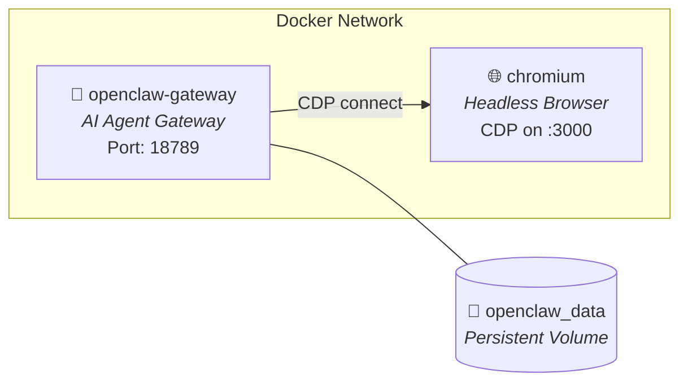

<div align="center">

# 🦞 OpenClaw Stack

**Production-ready Docker Compose stack for [OpenClaw](https://openclaw.ai) — the open-source, self-hosted AI agent gateway.**

[](https://docs.docker.com/compose/)
[](https://github.com/openclaw/openclaw)
[](LICENSE)
[](https://github.com/browserless/chromium)

Deploy OpenClaw with headless Chromium browser support in minutes.  
One command. Zero manual configuration.

</div>

---

## ✨ What is this?

This repository provides a **batteries-included Docker Compose stack** for deploying [OpenClaw](https://openclaw.ai) as a self-hosted AI agent gateway with remote browser capabilities.

### What you get

- 🤖 **AI Agent Gateway** — Connect to Claude, GPT-4, Gemini, Groq, or any OpenAI-compatible API
- 🌐 **Headless Chromium** — Built-in browser via [browserless/chromium](https://github.com/browserless/chromium) for web tasks
- 📱 **Multi-channel** — Telegram, Discord, WhatsApp, Slack, and more from a single deployment
- 🔒 **Security hardened** — Non-root execution, capability dropping, resource limits
- ⚡ **Auto-init** — First boot handles onboarding, browser config, and provider setup automatically
- 🔄 **Stateless restarts** — Persistent volume preserves config; restarts are instant

## 🏗️ Architecture



## 🚀 Quick Start

### Prerequisites

- [Docker](https://docs.docker.com/get-docker/) ≥ 20.10
- [Docker Compose](https://docs.docker.com/compose/install/) ≥ 2.0
- At least **4 GB RAM** available for containers
- At least one AI provider API key

### 1. Clone the repository

```bash
git clone https://github.com/dratct/openclaw-stack.git
cd openclaw-stack
```

### 2. Configure environment

```bash
cp .env.example .env
```

Edit `.env` and add your API key(s):

```env
# Required: at least one provider key
ANTHROPIC_API_KEY=sk-ant-...

# Optional providers
OPENAI_API_KEY=sk-...
GOOGLE_AI_API_KEY=...
OPENROUTER_API_KEY=...
```

> [!TIP]
> See [`.env.example`](.env.example) for the full list of configurable variables.

### 3. Start the stack

```bash
docker compose up -d
```

First boot takes **~2–3 minutes** while it:
1. Runs onboarding (local mode)
2. Configures gateway settings
3. Sets up headless Chromium connection

Subsequent restarts skip initialization and start immediately.

### 4. Access the Control UI

| Service | URL |
|---------|-----|
| **Control UI** | `http://localhost:18789` |
| **Health Check** | `http://localhost:18789/healthz` |

## ⚙️ Configuration

### Configuration Lifecycle

The entrypoint script has **two phases** with different persistence behaviors:

#### Phase 1 — First Boot Only (run once)

These settings are applied **only on the very first start** and never again. They are guarded by the init marker file `.docker-init-done`:

| Action | What it does |
|--------|-------------|
| `onboard --mode local` | Runs the interactive onboarding wizard in non-interactive mode |
| `gateway.mode = local` | Sets gateway to local mode |
| `gateway.bind` | Sets gateway bind to the value of `OPENCLAW_GATEWAY_BIND` (default: `lan`) |

> [!NOTE]
> After the first boot, these settings are **yours to customize** via the Control UI or CLI.
> They will not be overwritten on restart.

#### Phase 2 — Every Restart (override on each start)

These settings are **re-applied from environment variables on every container start**, overwriting any manual changes made via the Control UI or `openclaw.json`:

| Config | Source env variable | Behavior |
|--------|-------------------|----------|
| Custom chat provider (base URL, API key, model, capabilities) | `CHAT_*` | Overwrites chat provider config every restart |
| Memory embedding provider (base URL, API key, model) | `EMBED_*` | Overwrites `memorySearch` config every restart |
| CORS allowed origins | `OPENCLAW_PUBLIC_URL` | Rewrites `gateway.controlUi.allowedOrigins` every restart |
| Telegram channel | `TELEGRAM_BOT_TOKEN` | Re-registers the channel every restart |
| Browser CDP connection | *(hardcoded)* | Always sets `browser.cdpUrl=http://chromium:3000` |

> [!WARNING]
> If you manually edit custom provider, CORS, or browser settings via the Control UI, your changes **will be overwritten** on the next container restart. To make persistent changes, update the corresponding environment variables in `.env` (or Dokploy Environment) instead.

#### How to reset

| Goal | Command |
|------|---------|
| Re-run first-boot init | `docker exec openclaw-gateway rm /home/node/.openclaw/.docker-init-done` then restart |
| Skip a Phase 2 override | Remove or leave blank the corresponding env variable |

### Environment Variables

<details>
<summary><strong>🔑 Gateway</strong></summary>

| Variable | Description | Default |
|----------|-------------|---------|
| `OPENCLAW_GATEWAY_TOKEN` | Auth token (auto-generated on first boot) | — |
| `OPENCLAW_GATEWAY_PORT` | Control UI port mapping | `18789` |
| `OPENCLAW_GATEWAY_BIND` | Gateway process bind mode inside the container: `lan`, `loopback`, `tailnet`, `auto`, or `custom`. Must be `lan` (default) for Docker port mapping to work. | `lan` |
| `OPENCLAW_LISTEN_HOST` | Docker host bind address: `127.0.0.1` (local only) or `0.0.0.0` (public). This is the primary security layer controlling external access. | `127.0.0.1` |
| `OPENCLAW_PUBLIC_URL` | Public domain for CORS | — |
| `TZ` | Timezone | `Asia/Ho_Chi_Minh` |

</details>

<details>
<summary><strong>🤖 AI Providers</strong></summary>

| Variable | Description |
|----------|-------------|
| `ANTHROPIC_API_KEY` | Anthropic (Claude) API key |
| `OPENAI_API_KEY` | OpenAI API key |
| `GOOGLE_AI_API_KEY` | Google AI (Gemini) API key |
| `OPENROUTER_API_KEY` | OpenRouter API key |

</details>

<details>
<summary><strong>💬 Custom Chat Provider (OpenAI-compatible)</strong></summary>

Use any OpenAI-compatible chat/completions API (Together, Groq, LM Studio, local LLM, etc.):

| Variable | Description | Default |
|----------|-------------|---------|
| `OCS_CHAT_BASE_URL` | Provider base URL (e.g. `https://api.together.xyz/v1`) | — |
| `OCS_CHAT_API_KEY` | Provider API key | — |
| `OCS_CHAT_MODEL_ID` | Model identifier | — |
| `OCS_CHAT_PROVIDER_NAME` | Display name in OpenClaw | `chat` |
| `OCS_CHAT_SUPPORTS_IMAGES` | Enable vision/image capability | `false` |
| `OCS_CHAT_CONTEXT_WINDOW` | Max input tokens | `200000` |
| `OCS_CHAT_MAX_TOKENS` | Max output tokens | `8192` |

**Example — Together AI:**

```env
OCS_CHAT_BASE_URL=https://api.together.xyz/v1
OCS_CHAT_API_KEY=sk-...
OCS_CHAT_MODEL_ID=meta-llama/Llama-4-Maverick-17B-128E-Instruct-FP8
OCS_CHAT_PROVIDER_NAME=together
OCS_CHAT_SUPPORTS_IMAGES=true
OCS_CHAT_CONTEXT_WINDOW=200000
OCS_CHAT_MAX_TOKENS=8192
```

</details>

<details>
<summary><strong>🧠 Custom Embedding Provider (OpenAI-compatible, for memory search)</strong></summary>

Use a dedicated OpenAI-compatible embedding endpoint for memory search.
If not set, OpenClaw auto-detects from `OPENAI_API_KEY` / `GOOGLE_AI_API_KEY`.
`OCS_EMBED_API_KEY` falls back to `OCS_CHAT_API_KEY` when using the same provider for both.

| Variable | Description | Default |
|----------|-------------|---------|
| `OCS_EMBED_BASE_URL` | Embedding endpoint base URL | — |
| `OCS_EMBED_API_KEY` | Embedding API key (defaults to `OCS_CHAT_API_KEY`) | — |
| `OCS_EMBED_MODEL_ID` | Embedding model identifier | — |

**Example — same provider for chat + embed:**

```env
OCS_CHAT_BASE_URL=https://api.openai.com/v1
OCS_CHAT_API_KEY=sk-...
OCS_CHAT_MODEL_ID=gpt-4o

OCS_EMBED_BASE_URL=https://api.openai.com/v1
OCS_EMBED_MODEL_ID=text-embedding-3-small
# OCS_EMBED_API_KEY not needed — falls back to OCS_CHAT_API_KEY
```

**Example — separate providers (chat ≠ embed):**

```env
OCS_CHAT_BASE_URL=https://api.together.xyz/v1
OCS_CHAT_API_KEY=sk-together-...
OCS_CHAT_MODEL_ID=meta-llama/Llama-4-Maverick-17B-128E-Instruct-FP8

OCS_EMBED_BASE_URL=https://api.openai.com/v1
OCS_EMBED_API_KEY=sk-openai-...
OCS_EMBED_MODEL_ID=text-embedding-3-small
```

</details>

<details>
<summary><strong>📱 Telegram Bot</strong></summary>

| Variable | Description |
|----------|-------------|
| `TELEGRAM_BOT_TOKEN` | Bot token from [@BotFather](https://t.me/BotFather) |

The Telegram channel is automatically registered on container start when the token is set.

</details>

<details>
<summary><strong>⚖️ Resource Limits</strong></summary>

| Variable | Description | Default |
|----------|-------------|---------|
| `OPENCLAW_MEM_LIMIT` | Hard memory limit for Gateway | `4G` |
| `OPENCLAW_MEM_RESERVATION` | Reserved memory for Gateway | `2G` |
| `CHROMIUM_MEM_LIMIT` | Hard memory limit for Chromium | `2G` |
| `CHROMIUM_MEM_RESERVATION` | Reserved memory for Chromium | `512M` |

</details>
### Adding Chat Channels

```bash
# Telegram (auto-configured via env, or manually)
docker exec openclaw-gateway node dist/index.js \
  channels add --channel telegram --token "<TOKEN>"

# Discord
docker exec openclaw-gateway node dist/index.js \
  channels add --channel discord --token "<TOKEN>"

# WhatsApp (interactive QR login)
docker exec -it openclaw-gateway node dist/index.js channels login
```

## 🌐 Browser (Headless Chromium)

The stack includes a dedicated [browserless/chromium](https://github.com/browserless/chromium) container providing remote browser capabilities via Chrome DevTools Protocol (CDP).

OpenClaw automatically connects to the browser at `http://chromium:3000`.

**Verify browser connectivity:**

```bash
docker exec openclaw-chromium wget -qO- http://127.0.0.1:3000/json/version
```

**Restart browser if needed:**

```bash
docker restart openclaw-chromium
```

## 🔒 Security

This stack follows container security best practices:

- **Non-root execution** — OpenClaw runs as the `node` user
- **Capability dropping** — `NET_RAW` and `NET_ADMIN` removed
- **No privilege escalation** — `no-new-privileges:true`
- **Resource limits** — Memory capped at 4 GB (gateway) + 2 GB (browser)
- **Local port binding** — Ports bound to `127.0.0.1` by default (configurable via `OPENCLAW_LISTEN_HOST`)

> [!IMPORTANT]
> For production, always place behind a reverse proxy (Traefik, Nginx, Caddy) with TLS.

### Exposing Publicly

By default, ports are only accessible from `localhost` (`OPENCLAW_LISTEN_HOST=127.0.0.1`). To expose publicly, change the Docker host bind address:

```env
# .env — enable public access
OPENCLAW_LISTEN_HOST=0.0.0.0
OPENCLAW_PUBLIC_URL=https://openclaw.example.com
```

> [!NOTE]
> `OPENCLAW_GATEWAY_BIND` defaults to `lan` — this is required for Docker port mapping to work and should not be changed to `loopback` in containerized deployments. Access control from external networks is handled by `OPENCLAW_LISTEN_HOST`.

## 📊 Volumes

| Volume | Mount Point | Contents |
|--------|-------------|----------|
| `openclaw_data` | `/home/node` | Config, workspace, auth data, npm cache |

## 🔄 Updating

Pull the latest image and recreate:

```bash
docker compose pull
docker compose up -d
```

Or if using [Dokploy](https://dokploy.com), simply click **Redeploy**.

## 🛠️ Device Approval

If the Control UI requires device authentication after first deploy:

```bash
# List pending devices
docker exec openclaw-gateway node dist/index.js devices list

# Approve a device
docker exec openclaw-gateway node dist/index.js devices approve <device-id>
```

## 🐛 Troubleshooting

| Issue | Solution |
|-------|----------|
| **OOM (exit 137)** | Increase host memory or add swap space |
| **Browser connection failed** | `docker restart openclaw-chromium` and verify CDP |
| **Permission denied** | `docker exec -u root openclaw-gateway chown -R node:node /home/node` |
| **Force re-initialization** | `docker exec openclaw-gateway rm /home/node/.openclaw/.docker-init-done` then restart |
| **Port conflict** | Change `OPENCLAW_GATEWAY_PORT` in `.env` |

<details>
<summary><strong>View gateway logs</strong></summary>

```bash
# Follow logs
docker compose logs -f openclaw-gateway

# Last 100 lines
docker compose logs --tail 100 openclaw-gateway
```

</details>

## 📚 Resources

- [OpenClaw Official Site](https://openclaw.ai)
- [OpenClaw GitHub](https://github.com/openclaw/openclaw)
- [Docker Installation Docs](https://docs.openclaw.ai/install/docker)
- [Gateway Configuration](https://docs.openclaw.ai/gateway/configuration)

## ⚠️ Legal Disclaimer

This repository provides deployment configurations (Docker Compose files and scripts) under the MIT License. It does **not** contain or distribute the source code of the underlying software.

By running this stack, your system will pull and execute pre-built container images from third parties:
- **OpenClaw**: Licensed under the MIT License.
- **Browserless/Chromium**: Licensed under the [Server Side Public License (SSPL-1.0) / Commercial License](https://github.com/browserless/browserless/blob/main/LICENSE). 

> [!WARNING]  
> If you intend to use this stack for **commercial SaaS purposes**, you are responsible for ensuring compliance with the licenses of the downloaded images, particularly the Browserless SSPL or obtaining an appropriate commercial license from them. The maintainers of this configuration repository assume no liability for your usage of third-party software.

## 📄 License

This project is licensed under the [MIT License](LICENSE).

---

<div align="center">

**Built with ❤️ for the self-hosted AI community**

[Report Bug](https://github.com/dratct/openclaw-stack/issues) · [Request Feature](https://github.com/dratct/openclaw-stack/issues)

</div>
